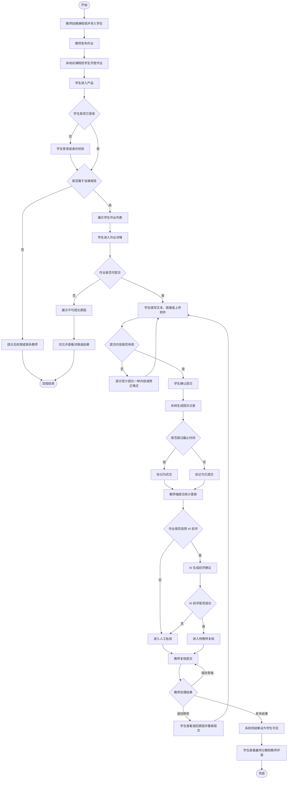
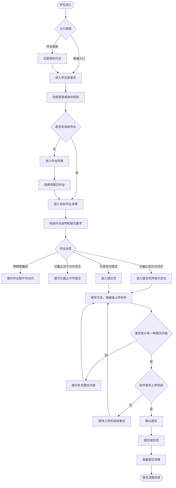
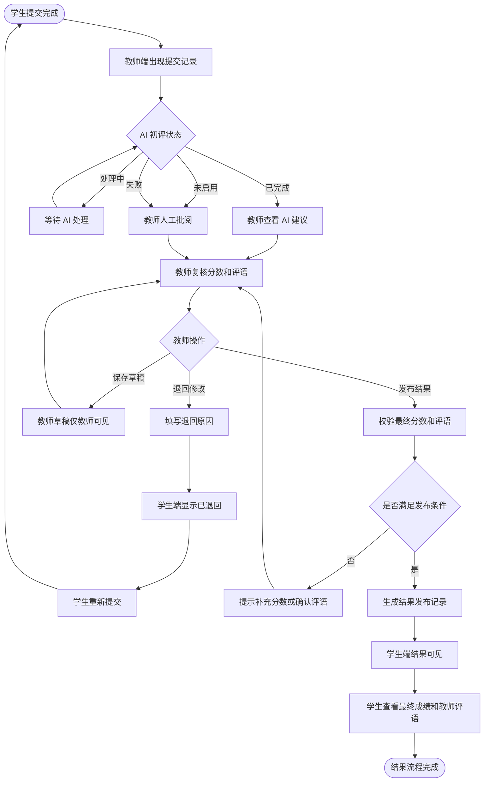
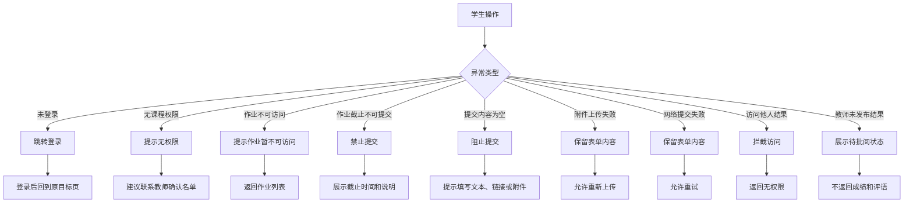
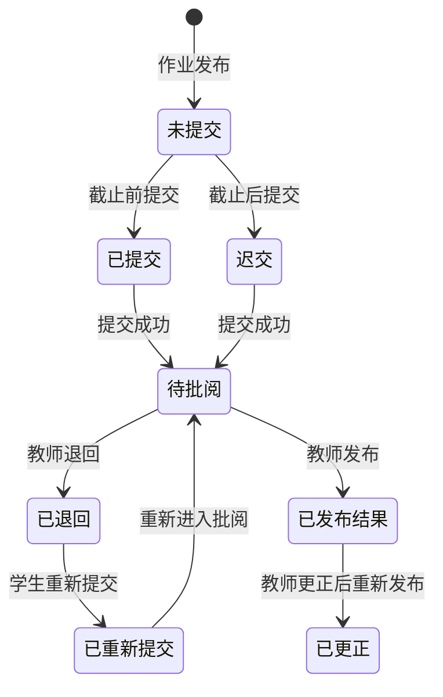
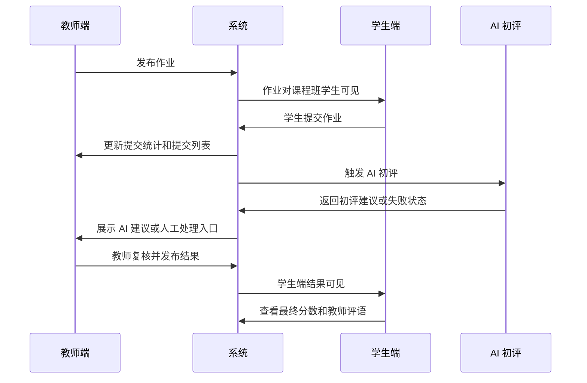

# 学生端业务流程图

## 1. 文档目的

本文档用于把学生端 MVP 的业务流程图形化，方便产品、研发、测试和业务方对齐：

- 业务怎么走。
- 逻辑怎么判断。
- 哪些角色参与。
- 哪些地方有分支、异常和状态变化。
- 需要哪些系统支撑能力。

本流程图围绕当前教务系统的核心闭环设计：

```text
教师发布作业 -> 学生提交作业 -> AI 初评 -> 教师复核 -> 教师发布结果 -> 学生查看结果
```

## 2. 角色说明

| 角色 | 说明 |
| --- | --- |
| 学生 | 查看作业、提交作业、查看提交状态和最终结果 |
| 教师 | 创建课程班、发布作业、查看提交、复核并发布结果 |
| 系统 | 负责身份校验、权限判断、状态流转、文件处理和数据同步 |
| AI | 对学生提交生成初评建议，仅教师可见 |

## 3. 总业务流程图



## 4. 学生提交流程图



## 5. 教师复核与学生结果可见流程图



## 6. 异常分支流程图



## 7. 学生端状态流转图



## 8. 教师端与学生端联动流程图



## 9. 流程节点说明

| 节点 | 判断逻辑 | 关键状态 | 支撑能力 |
| --- | --- | --- | --- |
| 身份校验 | 是否已登录，是否为当前学生 | 未登录、已登录 | 学生登录、token、回跳 |
| 权限判断 | 学生是否属于作业课程班 | 有权限、无权限 | 学生课程班关系 |
| 作业可见性 | 作业是否已发布且未撤回 | 可见、不可见 | 作业状态控制 |
| 提交判断 | 是否允许提交，是否迟交 | 未提交、已提交、迟交 | 截止时间、迟交规则 |
| 内容校验 | 文本、链接、附件至少一种 | 有效、无效 | 表单校验、上传服务 |
| AI 初评 | 是否启用，是否成功 | 处理中、已完成、失败 | AI 任务、失败兜底 |
| 教师复核 | 教师发布、退回或保存草稿 | 待复核、草稿、退回、已发布 | 批阅工作台 |
| 结果可见 | 教师是否发布结果 | 待批阅、学生可见 | 发布记录、权限过滤 |

## 10. 测试关注点

- 学生未登录访问作业链接，登录后是否能回到目标作业。
- 学生访问不属于自己的作业，是否被拦截。
- 作业草稿、撤回、已截止不可提交时，学生端是否正确提示。
- 学生不填写任何内容提交，是否被阻止。
- 附件上传失败后，表单内容是否保留。
- 截止后提交是否标记为迟交。
- 学生提交后，教师端提交数、未提交数是否同步变化。
- AI 初评失败时，教师是否能进入人工批阅。
- 教师退回后，学生端是否显示退回原因并允许重新提交。
- 教师未发布结果前，学生端是否看不到分数和评语。
- 教师发布结果后，学生端是否只显示最终分数和教师评语，不显示 AI 原始建议。
