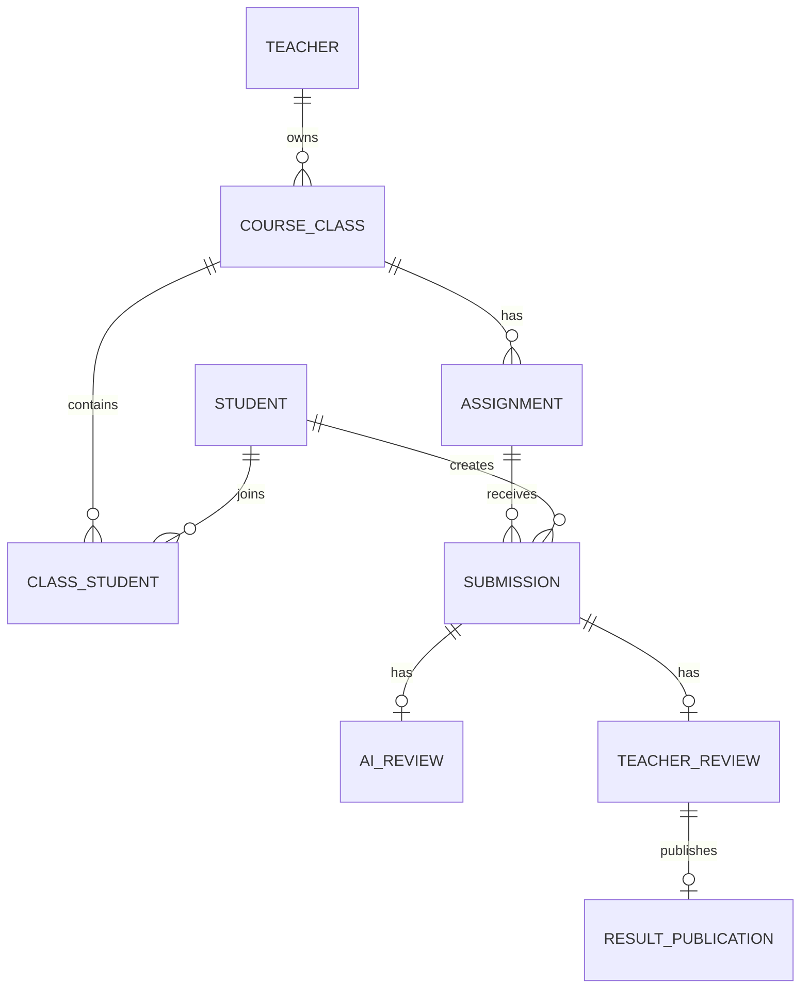

# 教师端教务系统数据结构与接口清单

## 1. 文档目的

本文档用于定义教师端 MVP 的核心数据对象、字段结构、状态枚举、对象关系和接口清单，为后续数据库设计、接口开发、前端联调和开发任务拆解提供依据。

范围包括：

- 教师端核心数据结构
- 学生端最小闭环数据结构
- AI 初评相关数据结构
- 成绩发布与导出数据结构
- MVP 接口清单

## 2. 核心对象关系

### 2.1 对象关系概览



### 2.2 关系说明

- 一个教师可以创建多个课程班。
- 一个课程班可以包含多个学生。
- 一个学生可以加入多个课程班。
- 一个课程班可以发布多个作业。
- 一个作业可以收到多个学生提交。
- 一个提交最多对应一条当前 AI 初评记录。
- 一个提交最多对应一条当前教师批阅记录。
- 一个教师批阅结果发布后生成结果发布记录。

## 3. 状态枚举

### 3.1 课程班状态

| 枚举值 | 中文含义 | 说明 |
| --- | --- | --- |
| active | 进行中 | 当前可发布作业、导入学生 |
| archived | 已归档 | 不再作为当前课程展示 |

### 3.2 作业状态

| 枚举值 | 中文含义 | 说明 |
| --- | --- | --- |
| draft | 草稿 | 学生不可见 |
| published | 已发布 | 学生可见，可提交 |
| closed | 已截止 | 到达截止时间 |
| archived | 已归档 | 不再展示在当前作业中 |
| deleted | 已删除 | 仅草稿可删除 |

### 3.3 提交状态

| 枚举值 | 中文含义 | 说明 |
| --- | --- | --- |
| not_submitted | 未提交 | 学生尚未提交 |
| submitted | 已提交 | 截止前提交 |
| late_submitted | 迟交 | 截止后提交 |
| returned | 已退回 | 教师退回修改 |
| resubmitted | 已重新提交 | 学生修改后再次提交 |

### 3.4 AI 初评状态

| 枚举值 | 中文含义 | 说明 |
| --- | --- | --- |
| not_started | 未开始 | 尚未触发 AI |
| processing | 处理中 | AI 正在处理 |
| completed | 已完成 | 已生成建议 |
| failed | 失败 | AI 处理失败 |
| manual_required | 需人工处理 | 无法继续 AI 初评 |

### 3.5 教师批阅状态

| 枚举值 | 中文含义 | 说明 |
| --- | --- | --- |
| unreviewed | 未批阅 | 教师尚未处理 |
| pending_review | 待复核 | AI 已完成，等待教师确认 |
| manual_review | 人工批阅 | 未启用 AI 或 AI 失败 |
| draft_saved | 已保存草稿 | 教师已编辑但未发布 |
| returned | 已退回 | 教师退回学生修改 |
| published | 已发布 | 学生可见最终结果 |

### 3.6 结果可见性

| 枚举值 | 中文含义 | 说明 |
| --- | --- | --- |
| teacher_only | 仅教师可见 | AI 建议或教师草稿 |
| student_visible | 学生可见 | 教师已发布 |
| corrected | 已更正 | 发布后再次修改并发布 |

## 4. 数据结构定义

## 4.1 Teacher 教师

| 字段 | 类型 | 必填 | 说明 |
| --- | --- | --- | --- |
| id | string | 是 | 教师 ID |
| name | string | 是 | 教师姓名 |
| phone | string | 是 | 手机号 |
| email | string | 否 | 邮箱 |
| school_name | string | 否 | 学校 |
| department_name | string | 否 | 院系 |
| avatar_url | string | 否 | 头像 |
| status | string | 是 | active / disabled |
| default_ai_comment_style | string | 否 | 默认 AI 评语风格 |
| created_at | datetime | 是 | 创建时间 |
| updated_at | datetime | 是 | 更新时间 |

### 示例

```json
{
  "id": "teacher_001",
  "name": "陈老师",
  "phone": "13800000000",
  "school_name": "某某大学",
  "department_name": "文学院",
  "status": "active",
  "default_ai_comment_style": "detailed_constructive"
}
```

## 4.2 CourseClass 课程班

| 字段 | 类型 | 必填 | 说明 |
| --- | --- | --- | --- |
| id | string | 是 | 课程班 ID |
| teacher_id | string | 是 | 创建教师 ID |
| course_name | string | 是 | 课程名称 |
| class_name | string | 是 | 班级名称 |
| term | string | 是 | 学期 |
| course_type | string | 否 | public / major / lab / other |
| description | string | 否 | 课程班说明 |
| status | string | 是 | active / archived |
| student_count | number | 是 | 学生数量，统计字段 |
| active_assignment_count | number | 是 | 进行中作业数，统计字段 |
| pending_review_count | number | 是 | 待复核数量，统计字段 |
| created_at | datetime | 是 | 创建时间 |
| updated_at | datetime | 是 | 更新时间 |

## 4.3 Student 学生

| 字段 | 类型 | 必填 | 说明 |
| --- | --- | --- | --- |
| id | string | 是 | 学生 ID |
| name | string | 是 | 姓名 |
| student_no | string | 是 | 学号 |
| phone | string | 否 | 手机号 |
| email | string | 否 | 邮箱 |
| status | string | 是 | active / disabled |
| created_at | datetime | 是 | 创建时间 |
| updated_at | datetime | 是 | 更新时间 |

## 4.4 ClassStudent 课程班学生关系

| 字段 | 类型 | 必填 | 说明 |
| --- | --- | --- | --- |
| id | string | 是 | 关系 ID |
| class_id | string | 是 | 课程班 ID |
| student_id | string | 是 | 学生 ID |
| display_class_name | string | 否 | 学生行政班或分组 |
| joined_at | datetime | 是 | 加入时间 |
| status | string | 是 | active / removed |

### 约束

- 同一个课程班内 `student_no` 不允许重复。
- 学生被移除后，历史提交和成绩仍保留。

## 4.5 Assignment 作业

| 字段 | 类型 | 必填 | 说明 |
| --- | --- | --- | --- |
| id | string | 是 | 作业 ID |
| class_id | string | 是 | 课程班 ID |
| teacher_id | string | 是 | 发布教师 ID |
| title | string | 是 | 作业标题 |
| description | text | 是 | 作业说明 |
| attachment_urls | array | 否 | 作业附件 |
| due_at | datetime | 是 | 截止时间 |
| submit_modes | array | 是 | file / text / link |
| score_type | string | 是 | percentage / level / pass_fail |
| max_score | number | 是 | 满分，百分制默认 100 |
| ai_enabled | boolean | 是 | 是否启用 AI 初评 |
| ai_rubric | text | 否 | AI 评分标准 |
| ai_comment_style | string | 否 | AI 评语风格 |
| allow_late_submit | boolean | 是 | 是否允许迟交 |
| status | string | 是 | draft / published / closed / archived / deleted |
| published_at | datetime | 否 | 发布时间 |
| created_at | datetime | 是 | 创建时间 |
| updated_at | datetime | 是 | 更新时间 |

### 约束

- `ai_enabled = true` 时，`ai_rubric` 必填。
- `published` 状态下学生可见。
- `draft` 状态下学生不可见。

## 4.6 Submission 学生提交

| 字段 | 类型 | 必填 | 说明 |
| --- | --- | --- | --- |
| id | string | 是 | 提交 ID |
| assignment_id | string | 是 | 作业 ID |
| student_id | string | 是 | 学生 ID |
| submit_text | text | 否 | 文本内容 |
| submit_link | string | 否 | 外部链接 |
| attachment_urls | array | 否 | 提交附件 |
| submitted_at | datetime | 否 | 提交时间 |
| status | string | 是 | not_submitted / submitted / late_submitted / returned / resubmitted |
| is_late | boolean | 是 | 是否迟交 |
| return_reason | text | 否 | 退回原因 |
| version | number | 是 | 提交版本 |
| created_at | datetime | 是 | 创建时间 |
| updated_at | datetime | 是 | 更新时间 |

### 约束

- 至少需要提交文本、链接或附件中的一种。
- 学生重新提交后，`version` 增加。
- 重新提交后应重新进入 AI 初评或人工批阅流程。

## 4.7 AIReview AI 初评

| 字段 | 类型 | 必填 | 说明 |
| --- | --- | --- | --- |
| id | string | 是 | AI 初评 ID |
| submission_id | string | 是 | 提交 ID |
| assignment_id | string | 是 | 作业 ID，便于查询 |
| student_id | string | 是 | 学生 ID，便于查询 |
| status | string | 是 | not_started / processing / completed / failed / manual_required |
| suggested_score | number | 否 | 建议分数 |
| suggested_comment | text | 否 | 建议评语 |
| strengths | text | 否 | 主要优点 |
| issues | text | 否 | 主要问题 |
| scoring_basis | text | 否 | 评分依据 |
| confidence | number | 否 | 置信度，0-1 |
| error_code | string | 否 | 失败代码 |
| error_message | text | 否 | 失败原因 |
| model_name | string | 否 | AI 模型名称 |
| prompt_version | string | 否 | 提示词版本 |
| started_at | datetime | 否 | 开始时间 |
| completed_at | datetime | 否 | 完成时间 |
| created_at | datetime | 是 | 创建时间 |
| updated_at | datetime | 是 | 更新时间 |

### 关键规则

- AI 初评仅教师可见。
- 学生重新提交后，旧 AI 初评不直接作为当前建议使用。
- AI 失败后可重新生成或转人工处理。

## 4.8 TeacherReview 教师批阅

| 字段 | 类型 | 必填 | 说明 |
| --- | --- | --- | --- |
| id | string | 是 | 教师批阅 ID |
| submission_id | string | 是 | 提交 ID |
| assignment_id | string | 是 | 作业 ID |
| student_id | string | 是 | 学生 ID |
| teacher_id | string | 是 | 批阅教师 ID |
| ai_review_id | string | 否 | 参考的 AI 初评 ID |
| final_score | number | 否 | 最终分数 |
| teacher_comment | text | 否 | 教师评语 |
| adopted_ai_score | boolean | 是 | 是否采纳 AI 分数 |
| adopted_ai_comment | boolean | 是 | 是否采纳 AI 评语 |
| status | string | 是 | unreviewed / pending_review / manual_review / draft_saved / returned / published |
| published_at | datetime | 否 | 发布时间 |
| created_at | datetime | 是 | 创建时间 |
| updated_at | datetime | 是 | 更新时间 |

### 关键规则

- 发布前 `final_score` 必填。
- 教师评语建议必填，但可由业务策略决定是否强制。
- `published` 后学生可见最终成绩和评语。

## 4.9 ResultPublication 结果发布记录

| 字段 | 类型 | 必填 | 说明 |
| --- | --- | --- | --- |
| id | string | 是 | 发布记录 ID |
| teacher_review_id | string | 是 | 教师批阅 ID |
| assignment_id | string | 是 | 作业 ID |
| student_id | string | 是 | 学生 ID |
| final_score | number | 是 | 发布时最终分数快照 |
| teacher_comment | text | 否 | 发布时教师评语快照 |
| visibility | string | 是 | student_visible / corrected |
| published_by | string | 是 | 发布教师 ID |
| published_at | datetime | 是 | 发布时间 |
| correction_reason | text | 否 | 更正原因 |

## 4.10 ExportTask 成绩导出任务

| 字段 | 类型 | 必填 | 说明 |
| --- | --- | --- | --- |
| id | string | 是 | 导出任务 ID |
| assignment_id | string | 是 | 作业 ID |
| teacher_id | string | 是 | 教师 ID |
| export_format | string | 是 | xlsx |
| fields | array | 是 | 导出字段 |
| status | string | 是 | processing / completed / failed |
| file_url | string | 否 | 导出文件地址 |
| error_message | text | 否 | 失败原因 |
| created_at | datetime | 是 | 创建时间 |
| completed_at | datetime | 否 | 完成时间 |

## 5. 接口设计约定

### 5.1 通用请求约定

- 所有接口使用 JSON。
- 需要登录的接口通过 Authorization 头传递 token。
- 时间使用 ISO 8601 格式。
- 列表接口统一支持分页。

### 5.2 通用响应结构

```json
{
  "code": 0,
  "message": "ok",
  "data": {}
}
```

### 5.3 分页响应结构

```json
{
  "code": 0,
  "message": "ok",
  "data": {
    "items": [],
    "page": 1,
    "page_size": 20,
    "total": 100
  }
}
```

### 5.4 错误码建议

| 错误码 | 含义 |
| --- | --- |
| 400001 | 参数错误 |
| 401001 | 未登录或登录过期 |
| 403001 | 无权限 |
| 404001 | 资源不存在 |
| 409001 | 数据冲突 |
| 422001 | 状态不允许当前操作 |
| 500001 | 系统错误 |
| 502001 | AI 服务异常 |
| 503001 | 文件服务异常 |

## 6. 接口清单

## 6.1 登录与账号

### 发送验证码

`POST /api/auth/sms-code`

请求：

```json
{
  "phone": "13800000000"
}
```

响应：

```json
{
  "cooldown_seconds": 60
}
```

### 教师手机号登录

`POST /api/auth/teacher/login`

请求：

```json
{
  "phone": "13800000000",
  "sms_code": "123456"
}
```

响应：

```json
{
  "token": "token",
  "teacher": {
    "id": "teacher_001",
    "name": "陈老师"
  }
}
```

### 获取当前教师信息

`GET /api/teacher/me`

### 更新当前教师信息

`PATCH /api/teacher/me`

请求：

```json
{
  "name": "陈老师",
  "school_name": "某某大学",
  "department_name": "文学院",
  "default_ai_comment_style": "detailed_constructive"
}
```

## 6.2 工作台

### 获取教师工作台概览

`GET /api/teacher/dashboard`

响应：

```json
{
  "metrics": {
    "active_class_count": 4,
    "pending_review_count": 38,
    "average_submit_rate": 0.82,
    "not_submitted_count": 23
  },
  "todos": [
    {
      "type": "pending_review",
      "title": "《大学语文》课程论文待复核",
      "description": "38 份 AI 已完成",
      "target_id": "assignment_001"
    }
  ],
  "course_status": []
}
```

## 6.3 课程班

### 获取课程班列表

`GET /api/course-classes`

查询参数：

| 参数 | 说明 |
| --- | --- |
| keyword | 搜索课程名或班级名 |
| status | active / archived |
| page | 页码 |
| page_size | 每页数量 |

### 创建课程班

`POST /api/course-classes`

请求：

```json
{
  "course_name": "大学语文",
  "class_name": "2026 春 A 班",
  "term": "2026 春",
  "course_type": "public",
  "description": "公共课大班"
}
```

### 获取课程班详情

`GET /api/course-classes/{class_id}`

### 更新课程班

`PATCH /api/course-classes/{class_id}`

### 归档课程班

`POST /api/course-classes/{class_id}/archive`

### 获取课程班学生列表

`GET /api/course-classes/{class_id}/students`

### 导入学生

`POST /api/course-classes/{class_id}/students/import`

请求类型：`multipart/form-data`

字段：

| 字段 | 说明 |
| --- | --- |
| file | Excel 或 CSV 文件 |

响应：

```json
{
  "imported_count": 60,
  "skipped_count": 2,
  "errors": [
    {
      "row": 12,
      "message": "学号重复"
    }
  ]
}
```

### 移除课程班学生

`DELETE /api/course-classes/{class_id}/students/{student_id}`

## 6.4 作业

### 获取作业列表

`GET /api/assignments`

查询参数：

| 参数 | 说明 |
| --- | --- |
| class_id | 课程班 ID |
| status | 作业状态 |
| keyword | 搜索标题 |
| page | 页码 |
| page_size | 每页数量 |

### 创建作业草稿

`POST /api/assignments`

请求：

```json
{
  "class_id": "class_001",
  "title": "课程论文：现代大学教育中的阅读与表达",
  "description": "请提交 1500-2500 字课程论文。",
  "due_at": "2026-06-20T20:00:00+08:00",
  "submit_modes": ["file", "text"],
  "score_type": "percentage",
  "max_score": 100,
  "ai_enabled": true,
  "ai_rubric": "内容完整性 30 分，论证逻辑 30 分，资料引用 20 分，表达规范 20 分。",
  "allow_late_submit": true
}
```

### 获取作业详情

`GET /api/assignments/{assignment_id}`

### 更新作业

`PATCH /api/assignments/{assignment_id}`

### 发布作业

`POST /api/assignments/{assignment_id}/publish`

### 关闭作业

`POST /api/assignments/{assignment_id}/close`

### 归档作业

`POST /api/assignments/{assignment_id}/archive`

### 获取作业统计

`GET /api/assignments/{assignment_id}/stats`

响应：

```json
{
  "student_count": 168,
  "submitted_count": 145,
  "not_submitted_count": 23,
  "pending_review_count": 38,
  "published_count": 80
}
```

## 6.5 提交管理

### 获取作业提交列表

`GET /api/assignments/{assignment_id}/submissions`

查询参数：

| 参数 | 说明 |
| --- | --- |
| keyword | 学生姓名或学号 |
| submission_status | 提交状态 |
| ai_status | AI 状态 |
| review_status | 批阅状态 |
| page | 页码 |
| page_size | 每页数量 |

### 获取提交详情

`GET /api/submissions/{submission_id}`

### 下载提交附件

`GET /api/submissions/{submission_id}/attachments/{attachment_id}/download`

### 提醒未提交学生

`POST /api/assignments/{assignment_id}/remind-not-submitted`

请求：

```json
{
  "student_ids": ["student_001", "student_002"]
}
```

## 6.6 学生端提交

### 获取学生作业列表

`GET /api/student/assignments`

### 获取学生作业详情

`GET /api/student/assignments/{assignment_id}`

### 提交作业

`POST /api/student/assignments/{assignment_id}/submit`

请求类型：`multipart/form-data` 或 JSON + 文件上传凭证。

字段：

| 字段 | 说明 |
| --- | --- |
| submit_text | 文本内容 |
| submit_link | 外部链接 |
| files | 附件 |

### 获取学生提交详情

`GET /api/student/submissions/{submission_id}`

### 获取学生批阅结果

`GET /api/student/assignments/{assignment_id}/result`

关键规则：

- 只返回教师已发布结果。
- 不返回 AI 原始建议。

## 6.7 AI 初评

### 触发单个提交 AI 初评

`POST /api/submissions/{submission_id}/ai-review`

### 批量触发 AI 初评

`POST /api/assignments/{assignment_id}/ai-reviews/batch`

请求：

```json
{
  "submission_ids": ["submission_001", "submission_002"]
}
```

### 获取 AI 初评详情

`GET /api/ai-reviews/{ai_review_id}`

### 重新生成 AI 初评

`POST /api/ai-reviews/{ai_review_id}/regenerate`

### 标记转人工处理

`POST /api/ai-reviews/{ai_review_id}/manual-required`

## 6.8 教师批阅

### 获取批阅工作台数据

`GET /api/assignments/{assignment_id}/review-workbench`

响应：

```json
{
  "assignment": {},
  "queue": [],
  "current_submission": {},
  "ai_review": {},
  "teacher_review": {}
}
```

### 获取单个提交批阅详情

`GET /api/submissions/{submission_id}/review`

### 保存教师批阅草稿

`PUT /api/submissions/{submission_id}/teacher-review`

请求：

```json
{
  "final_score": 88,
  "teacher_comment": "整体完成较好，论证结构清晰。",
  "adopted_ai_score": false,
  "adopted_ai_comment": true,
  "status": "draft_saved"
}
```

### 发布单个批阅结果

`POST /api/submissions/{submission_id}/teacher-review/publish`

请求：

```json
{
  "final_score": 88,
  "teacher_comment": "整体完成较好，论证结构清晰。"
}
```

### 退回学生修改

`POST /api/submissions/{submission_id}/return`

请求：

```json
{
  "return_reason": "请补充结论部分，并统一参考文献格式。"
}
```

### 批量发布结果

`POST /api/assignments/{assignment_id}/teacher-reviews/publish-batch`

请求：

```json
{
  "submission_ids": ["submission_001", "submission_002"]
}
```

## 6.9 成绩导出

### 创建成绩导出任务

`POST /api/assignments/{assignment_id}/exports`

请求：

```json
{
  "export_format": "xlsx",
  "fields": [
    "student_no",
    "student_name",
    "submission_status",
    "final_score",
    "teacher_comment",
    "published_at"
  ]
}
```

### 查询导出任务

`GET /api/exports/{export_task_id}`

### 下载导出文件

`GET /api/exports/{export_task_id}/download`

## 6.10 文件上传

### 创建上传凭证

`POST /api/files/upload-token`

请求：

```json
{
  "scene": "assignment_attachment",
  "file_name": "评分标准.pdf",
  "content_type": "application/pdf",
  "file_size": 204800
}
```

响应：

```json
{
  "upload_url": "https://upload.example.com/...",
  "file_url": "https://cdn.example.com/file.pdf",
  "expires_in": 600
}
```

## 7. 关键接口权限

| 接口范围 | 教师 | 学生 |
| --- | --- | --- |
| 教师工作台 | 可访问 | 不可访问 |
| 课程班管理 | 可访问 | 不可访问 |
| 作业创建与发布 | 可访问 | 不可访问 |
| 提交列表 | 可访问 | 不可访问 |
| 学生提交 | 不可代提交，除非后续支持代录 | 可访问本人作业 |
| AI 初评 | 可触发和查看 | 不可查看 |
| 教师批阅 | 可编辑和发布 | 不可编辑 |
| 批阅结果 | 可查看全部 | 仅可查看本人已发布结果 |
| 成绩导出 | 可访问 | 不可访问 |

## 8. 待确认接口问题

进入开发前建议确认：

- 学生是否需要独立登录 token，还是通过作业链接访问。
- 文件上传采用后端中转还是对象存储直传。
- AI 初评是同步返回还是异步任务。
- AI 初评是否需要记录完整 prompt 和模型响应。
- 成绩发布后是否允许撤回。
- 成绩更正是否需要学生端通知。
- 导出模板是否需要适配具体学校格式。
- 是否需要操作日志和审计记录。

## 9. 下一步建议

基于本数据结构与接口清单，下一步可以继续产出：

- 数据库表结构 SQL 草案。
- 前端页面与接口映射表。
- 开发任务拆解 backlog。
- AI 初评 prompt 模板。
- 文件上传与预览方案。
