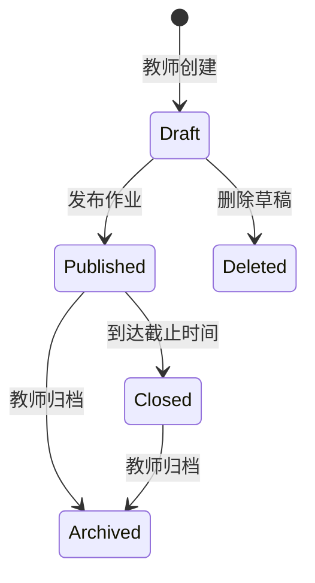
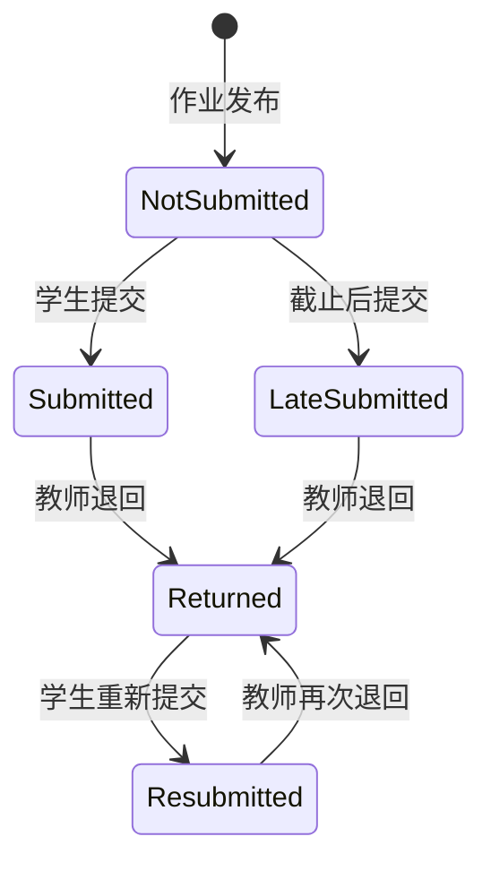
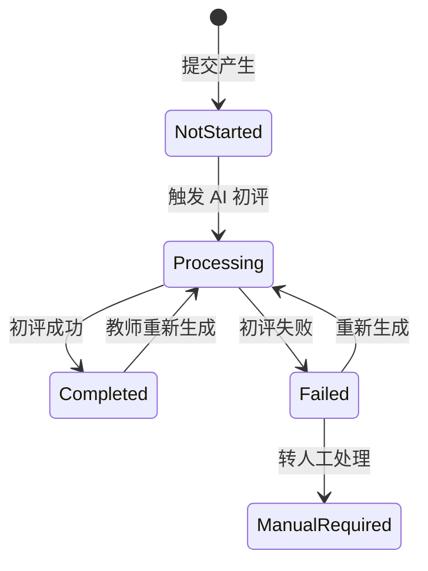
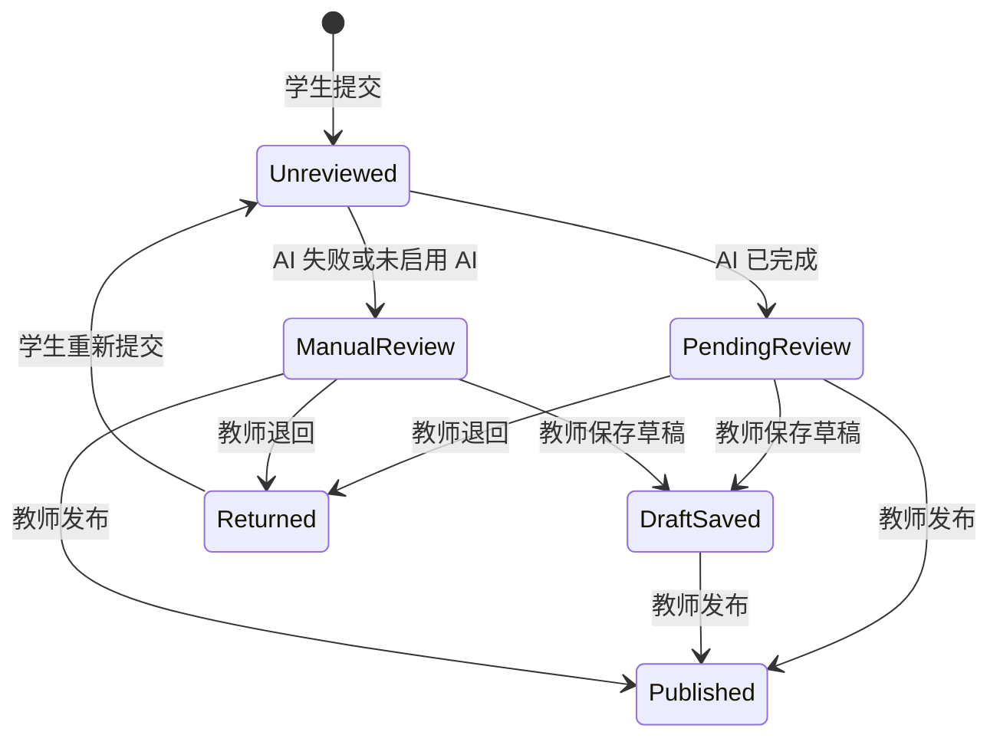
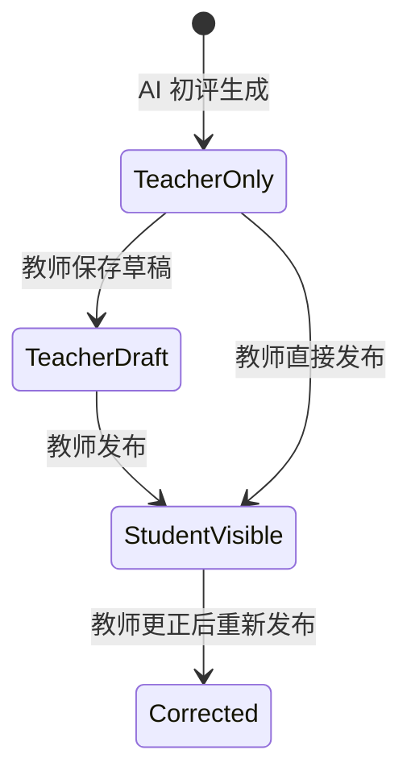

# 教师端页面交互说明与状态流转说明

## 1. 文档目的

本文档用于补全教师端 MVP 的页面交互细节和核心状态流转规则，帮助后续进行 UI 优化、接口设计、数据库设计和开发任务拆解。

适用范围：

- 教师端页面交互
- 学生端最小提交闭环
- 作业、提交、AI 初评、教师批阅、结果发布状态流转

核心原则：

- 教师端优先。
- AI 初评默认只对教师可见。
- 学生成绩和评语必须由教师发布后才可见。
- 页面操作必须能解释清楚状态变化。

## 2. 页面清单

### 2.1 教师端页面

MVP 教师端页面包括：

- 登录页
- 教师工作台
- 课程班列表页
- 课程班详情页
- 学生导入页
- 作业创建页
- 作业详情页
- 提交列表页
- 批阅工作台
- 成绩发布确认
- 成绩导出
- 个人设置页

### 2.2 学生端页面

MVP 学生端页面包括：

- 学生登录或作业访问页
- 作业列表页
- 作业详情页
- 作业提交页
- 提交成功页
- 批阅结果查看页

## 3. 教师端页面交互说明

### 3.1 登录页

#### 页面目标

让教师进入系统，并在首次登录时创建基础账号。

#### 主要入口

- 系统访问地址
- 作业管理系统邀请链接

#### 核心元素

- 手机号输入框
- 验证码输入框
- 获取验证码按钮
- 登录按钮
- 账号密码登录入口

#### 主要操作

1. 教师输入手机号。
2. 点击获取验证码。
3. 输入验证码。
4. 点击登录。
5. 登录成功后进入教师工作台。

#### 异常状态

- 手机号格式错误：提示“请输入正确手机号”。
- 验证码错误：提示“验证码错误或已过期”。
- 验证码发送频繁：提示倒计时。
- 账号被冻结：提示联系管理员。

#### 状态变化

- 未登录 -> 已登录
- 首次登录 -> 创建教师基础账号 -> 已登录

## 3.2 教师工作台

#### 页面目标

让教师快速知道今天需要处理什么，并提供高频入口。

#### 核心元素

- 当前课程班数量
- 待教师复核数量
- 平均提交率
- 未提交学生数量
- 今日待办
- 课程状态
- 快捷入口

#### 主要操作

- 点击“处理复核”进入批阅工作台。
- 点击“查看全部”进入作业详情或提交列表。
- 点击“提醒”向未提交学生发送提醒。
- 点击“发布新作业”进入作业创建页。
- 点击“管理课程班”进入课程班列表页。

#### 空状态

- 无待办：显示“今天暂无待处理事项”。
- 无课程班：显示创建课程班引导。
- 无作业：显示发布作业引导。

#### 异常状态

- 数据加载失败：显示重试按钮。
- AI 状态同步失败：显示“部分 AI 状态更新延迟”。

#### 设计原则

工作台只展示关键数据和高频动作，不展示完整业务流程说明。

## 3.3 课程班列表页

#### 页面目标

帮助教师管理所有课程班，并查看每个课程班的作业和提交进度。

#### 核心元素

- 创建课程班按钮
- 批量导入学生按钮
- 课程班搜索
- 状态筛选
- 课程班表格

#### 主要操作

- 创建课程班。
- 搜索课程班。
- 筛选进行中或已归档课程班。
- 查看课程班详情。
- 进入学生管理。
- 复制课程班邀请链接。

#### 空状态

- 无课程班：显示“创建第一个课程班”按钮。

#### 异常状态

- 创建失败：提示失败原因。
- 课程班名称重复：提示修改名称或确认创建。

## 3.4 课程班详情页

#### 页面目标

查看单个课程班下的学生、作业和提交情况。

#### 核心元素

- 课程班基本信息
- 学生列表
- 作业列表
- 提交率
- 待批阅数量

#### 主要操作

- 编辑课程班信息。
- 导入学生。
- 移除学生。
- 查看学生提交记录。
- 创建该课程班下的新作业。
- 查看某个作业详情。

#### 关键规则

- 已发布作业中的学生名单应保留快照，避免导入变化影响历史作业统计。
- 移除学生前应提示是否影响后续作业。

## 3.5 学生导入页

#### 页面目标

让教师批量导入学生名单。

#### 核心元素

- 下载模板
- 上传文件
- 字段预览
- 导入校验结果
- 确认导入按钮

#### 主要操作

1. 教师下载模板。
2. 填写学生信息。
3. 上传 Excel 或 CSV 文件。
4. 系统解析并展示预览。
5. 系统提示错误行和重复学生。
6. 教师确认导入。

#### 校验规则

- 姓名必填。
- 学号必填。
- 同一课程班内学号不能重复。
- 手机号或邮箱可选。

#### 异常状态

- 文件格式不支持。
- 文件解析失败。
- 必填字段缺失。
- 学号重复。

## 3.6 作业创建页

#### 页面目标

让教师发布作业，并配置 AI 初评所需信息。

#### 核心元素

- 课程班选择
- 作业标题
- 作业说明
- 截止时间
- 提交方式
- 评分方式
- AI 批阅开关
- AI 评分标准
- 保存草稿
- 发布作业

#### 主要操作

1. 教师选择课程班。
2. 填写作业标题和说明。
3. 设置截止时间。
4. 选择提交方式。
5. 设置评分方式。
6. 选择是否启用 AI 初评。
7. 填写 AI 评分标准。
8. 保存草稿或发布作业。

#### 必填规则

- 课程班必选。
- 作业标题必填。
- 截止时间必填。
- 提交方式必选。
- 启用 AI 初评时，评分标准必填。

#### 发布规则

- 草稿作业学生不可见。
- 发布后学生可见。
- 发布后可以修改说明和截止时间，但应记录修改时间。
- 发布后修改评分标准，应提示可能影响后续 AI 初评一致性。

#### 异常状态

- 截止时间早于当前时间。
- AI 评分标准为空。
- 附件上传失败。
- 网络错误导致保存失败。

## 3.7 作业详情页

#### 页面目标

展示作业整体进度和关键操作入口。

#### 核心元素

- 作业标题
- 课程班信息
- 截止时间
- 提交率
- 待教师复核数
- 未提交数
- 提醒未提交
- 批量 AI 初评
- 导出成绩

#### 主要操作

- 查看提交列表。
- 筛选提交状态。
- 搜索学生。
- 批量提醒未提交学生。
- 批量触发 AI 初评。
- 进入批阅工作台。
- 导出成绩。

#### 关键规则

- 作业未发布时不能有学生提交。
- 作业截止后仍可允许迟交，但需标记为迟交。
- 未经教师发布的成绩不应出现在学生端。

## 3.8 提交列表页

#### 页面目标

让教师按学生维度管理提交和批阅状态。

#### 核心元素

- 学生姓名
- 学号
- 提交状态
- AI 状态
- 批阅状态
- 建议分数
- 最终分数
- 操作按钮

#### 主要操作

- 按状态筛选。
- 搜索学生。
- 查看提交详情。
- 下载提交文件。
- 进入单个学生批阅。
- 批量触发 AI 初评。
- 批量提醒未提交。

#### 状态展示规则

- 未提交：显示提醒按钮。
- 已提交但 AI 未开始：显示触发 AI 初评。
- AI 已完成：显示待复核。
- AI 失败：显示人工批阅或重新生成。
- 已发布：显示最终分数。

## 3.9 批阅工作台

#### 页面目标

让教师在一个页面内完成“看原文、看 AI 建议、确认最终结果”。

#### 核心区域

- 左侧：学生提交队列
- 中间：作业原文或附件预览
- 右侧：AI 初评建议与教师复核表单

#### 主要操作

- 切换学生。
- 查看学生提交内容。
- 下载原文件。
- 查看 AI 建议分数。
- 查看 AI 建议评语。
- 查看主要问题和评分依据。
- 采纳 AI 建议。
- 修改最终分数。
- 修改教师评语。
- 保存草稿。
- 退回修改。
- 发布结果并进入下一份。
- AI 失败时进入人工批阅。

#### 关键规则

- AI 建议默认不能直接发布。
- 教师必须点击发布，学生才能看到结果。
- 教师修改 AI 建议后，应保存最终教师版本。
- 发布结果前需要校验最终分数和教师评语。
- 退回修改时应填写退回原因。

#### 异常状态

- 文件无法预览：显示下载入口。
- AI 初评失败：显示失败原因和重新生成按钮。
- 分数超出范围：阻止保存或发布。
- 发布失败：保留草稿，允许重试。

## 3.10 成绩发布确认

#### 页面目标

避免教师误发布成绩。

#### 触发入口

- 批阅工作台点击发布。
- 作业详情页批量发布。

#### 核心内容

- 发布对象数量。
- 是否包含未批阅学生。
- 是否包含 AI 失败但人工批阅完成的记录。
- 发布后学生可见提示。

#### 主要操作

- 确认发布。
- 取消发布。

#### 关键规则

- 未填写最终分数的记录不能发布。
- 未填写教师评语时可允许发布，但应提示确认。
- 发布后可支持更正，但需记录更正历史。

## 3.11 成绩导出

#### 页面目标

让教师导出可用于教务录入或线下归档的成绩表。

#### 核心字段

- 课程班
- 作业名称
- 姓名
- 学号
- 提交状态
- 最终分数
- 教师评语
- 发布时间

#### 主要操作

- 选择导出范围。
- 选择导出字段。
- 下载 Excel 文件。

#### 关键规则

- 默认导出最终成绩，不导出未发布 AI 初评建议。
- 如需导出 AI 建议，应作为教师侧内部字段，并明确标注。

## 3.12 个人设置页

#### 页面目标

维护教师基础信息和默认批阅偏好。

#### 核心元素

- 教师姓名
- 手机号
- 学校
- 院系
- 默认 AI 评语风格
- 成绩导出模板

#### 主要操作

- 修改个人资料。
- 设置默认 AI 评语风格。
- 配置导出模板。

## 4. 学生端页面交互说明

## 4.1 学生作业列表页

#### 页面目标

让学生看到自己需要完成的作业。

#### 核心元素

- 作业标题
- 所属课程
- 截止时间
- 提交状态
- 批阅状态

#### 主要操作

- 查看作业详情。
- 进入提交页。
- 查看已发布结果。

## 4.2 学生作业详情页

#### 页面目标

让学生理解作业要求。

#### 核心元素

- 作业说明
- 附件
- 截止时间
- 提交要求
- 提交按钮

#### 关键规则

- 学生不可见 AI 评分标准中的内部教师提示。
- 学生不可见未发布的 AI 初评。

## 4.3 学生提交页

#### 页面目标

让学生完成作业提交。

#### 主要操作

- 上传附件。
- 填写文本说明。
- 填写外部链接。
- 提交作业。
- 截止后提交时显示迟交提示。

#### 异常状态

- 文件过大。
- 文件格式不支持。
- 上传失败。
- 作业已关闭提交。

## 4.4 批阅结果查看页

#### 页面目标

让学生查看教师发布后的最终结果。

#### 核心元素

- 最终分数
- 教师评语
- 发布时间
- 退回修改原因

#### 关键规则

- 只展示教师发布后的结果。
- 不展示 AI 建议分数和 AI 原始评语。

## 5. 核心状态流转

## 5.1 作业状态流转

### 状态说明

- Draft：草稿，学生不可见。
- Published：已发布，学生可见并可提交。
- Closed：已截止，是否允许迟交由作业配置决定。
- Archived：已归档，不再作为当前教学任务展示。
- Deleted：草稿删除，不进入学生端。

## 5.2 提交状态流转

### 状态说明

- NotSubmitted：未提交。
- Submitted：已提交。
- LateSubmitted：迟交。
- Returned：教师退回修改。
- Resubmitted：学生重新提交。

## 5.3 AI 初评状态流转

### 状态说明

- NotStarted：未开始。
- Processing：处理中。
- Completed：已完成。
- Failed：失败。
- ManualRequired：需人工处理。

### 失败原因示例

- 文件无法解析。
- 文件内容为空。
- 文本过短。
- AI 服务异常。
- 作业评分标准缺失。

## 5.4 教师批阅状态流转

### 状态说明

- Unreviewed：未批阅。
- PendingReview：AI 完成，待教师复核。
- ManualReview：人工批阅。
- DraftSaved：教师已保存批阅草稿。
- Published：已发布结果。
- Returned：已退回学生修改。

## 5.5 结果可见性流转

### 可见性规则

- TeacherOnly：AI 初评仅教师可见。
- TeacherDraft：教师草稿仅教师可见。
- StudentVisible：学生可见最终成绩和评语。
- Corrected：学生可见更正后的最终结果，系统记录更正历史。

## 6. 关键业务规则

### 6.1 AI 初评与教师复核

- AI 初评必须绑定一次学生提交。
- 学生重新提交后，旧 AI 初评不应直接复用。
- 教师可以采纳 AI 建议，也可以完全重写。
- 最终分数以教师发布结果为准。
- 学生端不展示 AI 原始建议。

### 6.2 作业修改

- 草稿状态可自由修改。
- 已发布后修改截止时间，应通知学生。
- 已发布后修改评分标准，应只影响后续 AI 初评，并提示教师。
- 已截止作业可延长截止时间。

### 6.3 迟交

- 截止后提交标记为迟交。
- 迟交作业仍可进入 AI 初评和教师批阅。
- 导出成绩时应包含迟交标记。

### 6.4 退回修改

- 教师退回必须填写原因。
- 学生重新提交后，提交状态变为重新提交。
- 重新提交后应重新进入 AI 初评或人工批阅流程。

### 6.5 成绩发布与更正

- 发布前必须有最终分数。
- 发布前建议有教师评语。
- 发布后学生可见。
- 发布后如需修改，应记录更正时间和操作人。

## 7. 待确认问题

以下问题建议在进入接口和开发任务拆解前确认：

- 学生端登录方式：账号登录、短信登录，还是作业链接免登录。
- 是否允许学生多次提交，还是提交后只能教师退回再改。
- 作业截止后是否默认允许迟交。
- AI 初评是学生提交后自动触发，还是教师手动批量触发。
- 成绩发布后是否允许撤回。
- 是否需要助教角色。
- 成绩导出是否需要适配具体学校模板。
